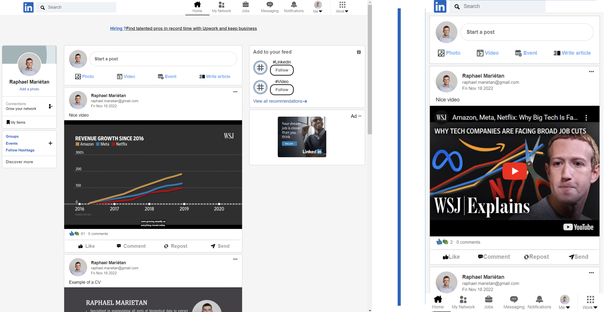

# Web App Clone of LinkedIn Using ReactJS, Firebase and Redux

Full-stack responsive implementation of a LinkedIn web app, with possibility to sign in with Google, view and add posts (text, images and videos), which are in turn saved on the server-side using the Firebase backend service. Only the sign-in page and the home page are implemented. 

 

 

The design is responsive and goes for the mobile mode once under a certain screen width. It then switches to a vertical design (on the right in the figure above).

### Demo of the app

<video src="" alt='linkedin-demo.mp4'>
</video>

 

