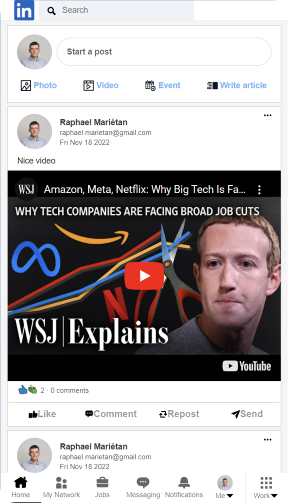
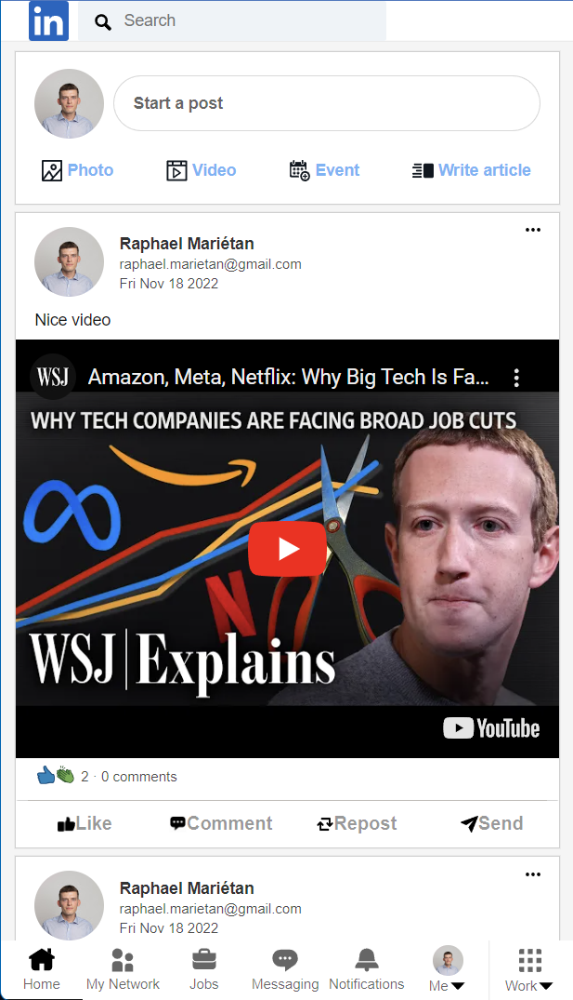

# Web App Clone of LinkedIn Using ReactJS, Firebase and Redux

Full-stack implementation of a LinkedIn web app, with possibility to sign in with Google, view and add posts (text, images and videos), which are in turn saved using the backend implementation. Only the sign-in page and the home page are implemented. 

 

 

 

### Demo of the app

<video src="" alt='linkedin-demo.mp4'>
</video>
